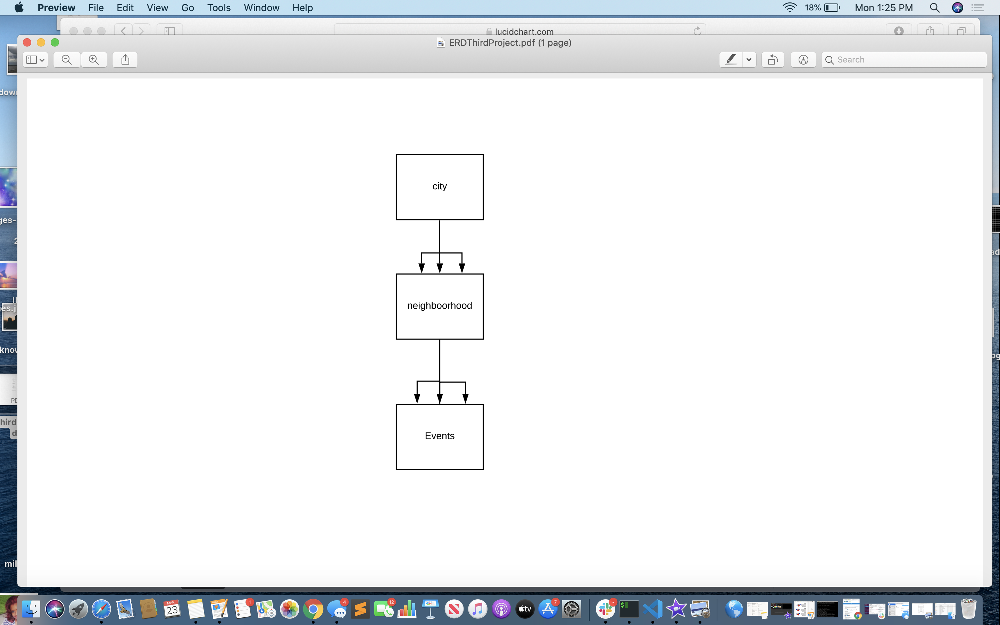

    The idea of the app is for people to have the ability to upload real-time weather events and the events exact location.

    Problem: There currently isn't a resource that allows you to see current information about weather event and their specific location from the people actually witnessing these events.

    Solution: Create a platform like craiglist where users can post current weather events, exact location, picture and comment. Other users can see information and be wiser in their decisin making as it relates to current weather events.

Information is always key to wise decision making.

            

[Trello](https://www.trello.com/b/T1BmkSeg/drone-aid)

[deployed heroku ](https://www.weatherwize.herokuapp.com/)

